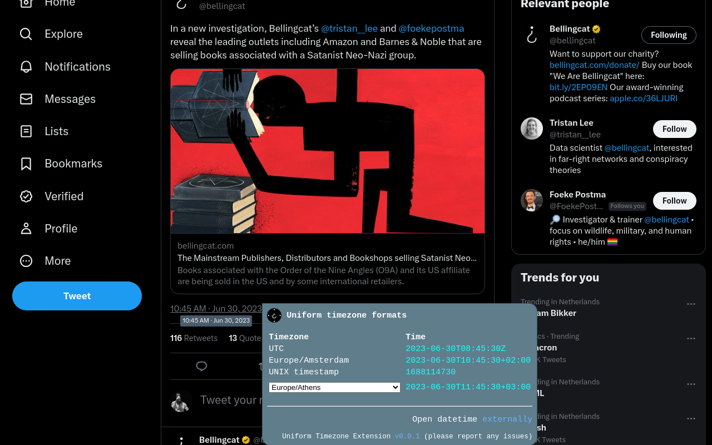

# Uniform Timezone Extension

Tries to bring standardization into social media posts' date-time values.

> Why 1? Working with standard timezones (such as UTC) is useful when cross-referencing dates from distinct online platforms.
>
> Why 2? Some platforms actively hide the real date/time of a post (eg: tiktok, youtube, ...).

This extension converts and decodes, where possible, complete upload/post date-time values into standard timezones (like UTC or your machine's local timezone) and allows the conversion to any other timezone, besides exporting/copying all values.

Install on [brave/chrome](https://chrome.google.com/webstore/detail/uniform-timezone-extensio/fhpdgikedeljapdckiegnjiendkhphlg).

### Currently supported platforms

| Platform  | Status | inspired by                                                                                                                                      |
| --------- | ------ | ------------------------------------------------------------------------------------------------------------------------------------------------ |
| Twitter/X | ✅      |                                                                                                                                                  |
| Tiktok    | ✅*     | [tiktok-timestamp](https://bellingcat.github.io/tiktok-timestamp/)                                                                               |
| Discord   | ✅*     |                                                                                                                                                  |
| Instagram | ✅      |                                                                                                                                                  |
| Bluesky   | ✅*     | works only for english translation of the platform, hard to expand                                                                               |
| Wayback Machine   | ✅     | |
| Linkedin  | TODO   | come help! [Linkedin-post-timestamp-extractor](https://ollie-boyd.github.io/Linkedin-post-timestamp-extractor/)                                  |
| Youtube   | TODO   | come help! it requires the official API (see [amnesty youtube dataviewer](https://citizenevidence.amnestyusa.org/)) / and possibly file metadata |
| Facebook  | TODO   | come help!                                                                                                                                       |
| GitHub    | TODO   | come help!                                                                                                                                       |
| Vkontakte | TODO   | is it possible? come help!                                                                                                                       |
| More      | ...    | please suggest more via [issues](https://github.com/bellingcat/uniform-timezone/issues)                                                          |

- ✅ works on all known cases
- ✅* works on most cases with exceptions
- TODO: come help! look at the issues or open a new one. If you want to start working on something use the issues to let the community know.

### Twitter ✅
How to use?
1. Hover over any time element on the page.
2. Also works on tweets archived on web.archive.org.

### Tiktok ✅*
How to use?

Timestamps handled by this script:
 * Individual `/video/` pages -> hover over username
 * User page video thumbnails -> hover over username/date
 * `/explore` feed page -> hover over username/date
 * `/foryou` feed page -> hover over username/date
 *. Also works on tiktoks archived on web.archive.org.
Timestamps not handled by this script:
 * "you may like" thumbnails -> is it possible to do it for the "you may like" section on the right side of a video page? there is no id in the html but perhaps the click event listener could somehow be intercepted/mocked.

Timestamps not handled by this script:
1. video thumbnails on the right pane AKA "You may like". (can you find a way to do it?)

### Discord ✅*
How to use? Hover over any time element on the page.

Timestamps handled by this script:
 * messages (in all channel types)
Timestamps not handled by this script:
 * message edits
 * forum thread overview
 * Not enabled on the wayback machine.

### Instagram ✅
How to use? Hover over any time element on the page.

 * All timestamps should be properly parsed.
 * Not all post urls are read (possible improvement).
 * Not enabled on the wayback machine.

### Blusky ✅*
How to use? Hover over any time element on the page.

 * Only works for the english language translation of bsky.app
 * Not enabled on the wayback machine.

---

#### See below if you want to contribute and check the [open issues](https://github.com/bellingcat/uniform-timezone/issues).

<h1>Development & Contributing</h1>

### 🛠 Build locally

1. Checkout the copied repository to your local machine eg. with `git clone https://github.com/my-username/my-awesome-extension/`
1. Run `npm install` to install all required dependencies
1. Run `npm run build`

The build step will create the `distribution` folder, this folder will contain the generated extension.

### 🏃 Run the extension

(optional) Using [web-ext](https://extensionworkshop.com/documentation/develop/getting-started-with-web-ext/) is recommended for automatic reloading and running in a dedicated browser instance. Alternatively you can load the extension manually (see below).

1. Run `npm run watch` to watch for file changes and build continuously
2. Then either [load the extension manually in Chrome](https://www.smashingmagazine.com/2017/04/browser-extension-edge-chrome-firefox-opera-brave-vivaldi/#google-chrome-opera-vivaldi) or [Firefox](https://www.smashingmagazine.com/2017/04/browser-extension-edge-chrome-firefox-opera-brave-vivaldi/#mozilla-firefox) by uploading unpacked extension (you need to manuall click the update button when making changes)
3. OR use [web-ext](https://extensionworkshop.com/documentation/develop/getting-started-with-web-ext/) for autoreloading
   1. run `npm install --global web-ext` (only only for the first time)
   2. In another terminal, run `web-ext run -t chromium`
4. Check that the extension is loaded by going to any of the implemented platforms

### Add a new timezone fixer
To add a new fixer you need:
1. edit [manifest.json](source/manifest.json) `content_scripts` and `web_accessible_resources` to include wildcards for the platform and reference a new content-script file
2. JS logic in the content-script file: see the example for [twitter](source/js/timezone-fixers/twitter.js). Feel free to add additional CSS if needed.
3. If the platform is archivable on archive.org try to add your fixer there as well (see the example for twitter in manifest.json)
4. Test and make a PR with screenshots/notes on implementation if needed

### Publishing (WIP)

It's possible to automatically publish to both the Chrome Web Store and Mozilla Addons at once by adding these secrets on GitHub Actions:

1. `CLIENT_ID`, `CLIENT_SECRET`, and `REFRESH_TOKEN` from [Google APIs][link-cws-keys].
2. `WEB_EXT_API_KEY`, and `WEB_EXT_API_SECRET` from [AMO][link-amo-keys].

Also include `EXTENSION_ID` in the secrets ([how to find it](https://stackoverflow.com/a/8946415/288906)) and add Mozilla’s [`gecko.id`](https://developer.mozilla.org/en-US/docs/Mozilla/Add-ons/WebExtensions/manifest.json/browser_specific_settings) to `manifest.json`.

The GitHub Actions workflow will:

1. Build the extension
2. Create a version number based on the current UTC date time, like [`19.6.16`](https://github.com/fregante/daily-version-action) and sets it in the manifest.json
3. Deploy it to both stores

#### Auto-publishing (WIP)

Thanks to the included [GitHub Action Workflows](.github/workflows), if you set up those secrets in the repo's Settings, the deployment will automatically happen:

- on a schedule, by default [every week](.github/workflows/release.yml) (but only if there are any new commits in the last tag)
- manually, by clicking ["Run workflow"](https://github.blog/changelog/2020-07-06-github-actions-manual-triggers-with-workflow_dispatch/) in the Actions tab.

